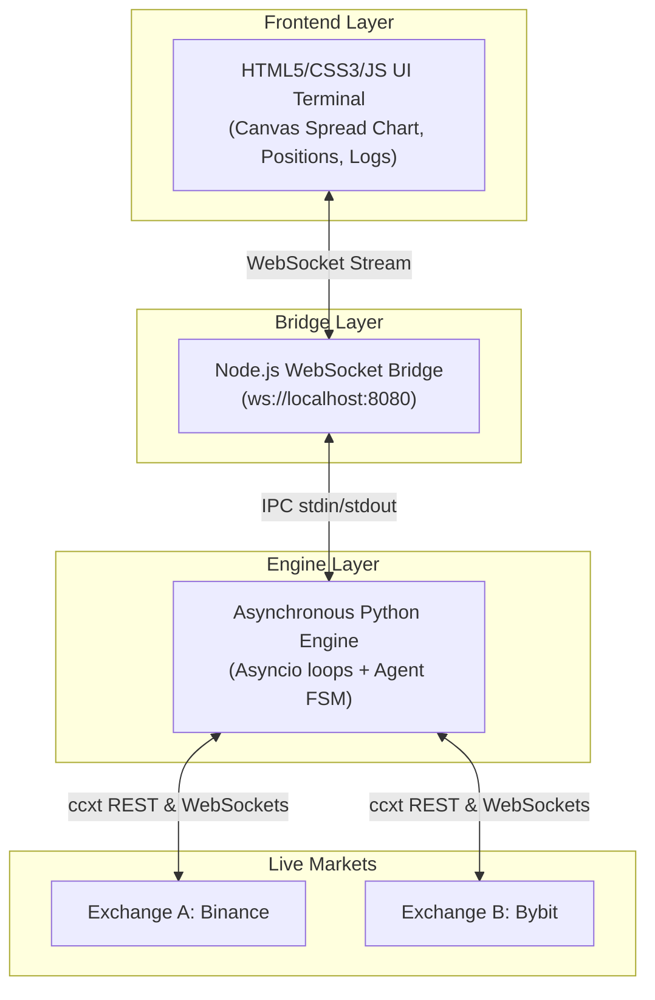

# ⚡ Agentic Arbitrage Command Center

[](https://opensource.org/licenses/ISC)
[]()
[]()

A professional, high-performance cryptocurrency trading dashboard and execution system. It integrates a **sophisticated dark-mode trading terminal frontend** with a **robust, asynchronous multi-exchange Python execution engine** implementing a delta-neutral funding rate arbitrage strategy.

Designed to mimic premium institutional trading suites, the visual theme uses a high-contrast dark palette inspired by Binance-style aesthetics with professional green/red indicator systems and high-density information displays.

---

## 📈 Why Delta-Neutral Funding Arbitrage?

> [!NOTE]
> Funding rates are periodic payments made to or by perpetual contract traders to keep perpetual contract prices close to index spot prices. 
> By longing an asset on one exchange (e.g., Binance Spot) and shorting the corresponding perpetual contract on another (e.g., Bybit Perpetual), you capture the funding rate differential while remaining **delta-neutral** (immune to asset price fluctuations).

---

## 🏗️ System Architecture



### Flow of Execution
1. **Telemetry Feed**: The Python engine streams JSON lines on `stdout` with order book events and FSM status ticks.
2. **IPC Pipe**: Node.js captures stdout, aggregates positions state, and caches a history of the last 100 log items.
3. **UI Sync**: When the frontend client connects, the bridge sends a `SYNC_HISTORY` packet to instantly render the current state. Live updates are then streamed as `LIVE_STREAM` events.

---

## 📂 Project Structure

```
agentic-arbitrage-dashboard/
├── index.html            # Main Trading Terminal UI Layout
├── styles.css            # Professional dark-mode design system & visual tokens
├── app.js                # Frontend logic & WebSocket stream handler
├── chart.js              # HTML5 Canvas chart engine (spreads & predictions)
├── bridge.js             # Node.js WebSocket Bridge server
├── engine/               # Python Async Execution Engine
│   ├── __init__.py
│   ├── config.py         # Type-safe Configuration dataclass
│   ├── telemetry.py      # Structured JSON telemetry formatting
│   ├── state_machine.py  # Finite State Machine (FSM) controller
│   ├── engine.py         # Async TaskGroup loops (Spread, Arb, Status)
│   ├── main.py           # CLI entry point with command argparse
│   └── requirements.txt  # Python requirements (ccxt, aiohttp)
└── README.md             # Project Documentation
```

---

## 🖥️ Terminal Interface Breakdown

| Section | Key Features | Visual Indicators |
| :--- | :--- | :--- |
| **Top Header** | Real-time BTC price feed, Wallet balance tracker, Notifications | Connected status (green glow) / Disconnected (pulsing red) |
| **Spread Chart** | HTML5 Canvas rendering of live spreads, AI-predicted bounds, volume bars | Cyan line (actual spread), Gold line (AI prediction), Yellow dashed line (Arb threshold) |
| **Orchestrator Logs**| Live-scrolling terminal feed color-coded by state transitions | Custom styling for `SCAN`, `ANALYZE`, `EXECUTE`, and `STATUS` actions |
| **Active Positions** | Leg tracker (Long vs. Short), entry price, current mark price, and live P&L | Green positive P&L / Red negative P&L with custom hover liquidation triggers |

---

## ⚙️ Python Agent FSM States

The engine drives an active state machine that guides the strategy lifecycle securely:

*   **`IDLE`**: Initial state; verifying exchange API keys and establishing market connections.
*   **`SCANNING`**: Actively polling order book spreads and comparing actual spread with `--spread-threshold`.
*   **`AMBUSH`**: Spread is nearing execution threshold; priming order execution pipelines.
*   **`EXECUTING`**: Orders are dispatched concurrently to both exchanges (Dual-market execution).
*   **`ACTIVE_CYCLE`**: Both legs filled successfully; positions are monitored for accrued funding fees and risk parameters.
*   **`LIQUIDATING`**: Triggered by either stop-loss/take-profit targets or manual user override; sends offsetting orders immediately to restore delta-neutral state.

---

## 🚀 Quick Start Guide

### 1. Prerequisites
- **Node.js** (v18+)
- **Python** (3.10+)

### 2. Dependency Installation

Set up the Python execution environment:
```bash
pip install -r engine/requirements.txt
```

### 3. Execution

1. Start the WebSocket server and the python sub-process:
   ```bash
   node bridge.js
   ```
2. Open the dashboard UI in your browser:
   ```bash
   open index.html
   ```

---

## 🛠️ CLI Arguments Configuration

Customize execution behavior directly from the terminal or via `bridge.js`:

```bash
python -m engine.main --symbol ETH/USDT --spread-threshold 0.020 --size 0.05
```

| Flag | Default | Description |
| :--- | :--- | :--- |
| `--symbol` | `BTC/USDT` | Target asset pair |
| `--exchange-a` | `binance` | Spot leg exchange |
| `--exchange-b` | `bybit` | Futures leg exchange |
| `--spread-threshold` | `0.015` | Minimum spread percentage to trigger orders (`1.5%`) |
| `--size` | `0.01` | Position size in base currency |
| `--max-risk` | `15.0` | Maximum portfolio risk threshold |
| `--no-sandbox` | *False* | **WARNING**: Disables sandbox mode, exposing live funds |
| `--pretty` | *False* | Formats output telemetry JSON to be human-readable |

---

## 🔍 Troubleshooting

*   **Port Conflict (`EADDRINUSE: :::8080`)**:
    The Node bridge runs a WebSocket server on port 8080. If it is already in use, find the process using:
    ```bash
    lsof -i :8080
    ```
    Then stop it or change the port configuration in `bridge.js` and `app.js`.
*   **Python Engine Path (`python3` vs `python`)**:
    The bridge spawns `python3` by default. If your environment uses `python`, modify the spawn target in `bridge.js` (line 42).
