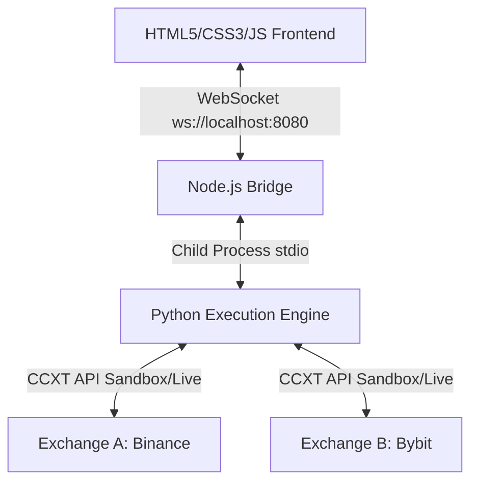

# Agentic Arbitrage Command Center

A professional, high-performance cryptocurrency trading dashboard and execution system. It integrates a **sophisticated dark-mode trading terminal frontend** with a **robust, asynchronous multi-exchange Python execution engine** implementing a delta-neutral funding rate arbitrage strategy.

Designed to mimic premium institutional trading suites, the visual theme uses a high-contrast dark palette inspired by Binance-style aesthetics with professional green/red indicator systems and high-density information displays.

---

## Architecture Overview



The system operates in three layers:
1. **Frontend Terminal**: A vanilla HTML5, CSS3, and JS interface that uses HTML5 Canvas to render real-time spreads, telemetry feeds, and open positions.
2. **Node.js WebSocket Bridge**: Orchestrates communication, maintains connection state, caches rolling history, and maps telemetry streams.
3. **Asynchronous Python Engine**: Multi-threaded and FSM-driven core that monitors order books, calculates spreads, and executes dual-market trades.

---

## Project Structure

```
agentic-arbitrage-dashboard/
├── index.html            # Trading Terminal Frontend
├── styles.css            # Professional dark-mode design system & visual tokens
├── app.js                # Frontend logic & WebSocket client
├── chart.js              # Canvas chart rendering engine (spreads & predictions)
├── bridge.js             # Node.js WebSocket Bridge server
├── engine/               # Python Async Execution Engine
│   ├── __init__.py
│   ├── config.py         # Configuration dataclass
│   ├── telemetry.py      # Structured JSON telemetry emitter
│   ├── state_machine.py  # Finite State Machine (FSM)
│   ├── engine.py         # Async event loops
│   ├── main.py           # CLI entry point
│   └── requirements.txt  # Python requirements (ccxt, aiohttp)
└── README.md             # Project Documentation
```

---

## Features

### 1. Institutional Trading Terminal (Frontend)
- **Real-Time Data Tickers**: Active tickers for BTC/USDT, live portfolio balance, and system status indicators.
- **Dynamic Funding Spread Chart**: High-performance Canvas rendering of actual vs. AI-predicted spreads, threshold overlays, and volume indicators.
- **Agent Logs Feed**: Color-coded, auto-scrolling terminal output displaying live logs direct from the Python FSM.
- **Positions Tracker**: Active trades monitor detailing entry prices, mark prices, individual legs, accrued funding fees, and live P&L with instant manual liquidation buttons.

### 2. Async Python Execution Engine
- **Asynchronous Loop Concurrency**: Powered by `asyncio.TaskGroup` dividing tasks into order book monitoring, spread valuation, and heartbeat telemetry.
- **Finite State Machine (FSM)**:
  `IDLE` → `SCANNING` → `AMBUSH` → `EXECUTING` → `ACTIVE_CYCLE` → `LIQUIDATING`
- **Safety Locks**:
  - Sandbox mode enabled by default to prevent accidental live execution.
  - Automatic position stop-loss and take-profit thresholds.
  - Programmatic kill switch (listens to `KILL` / `STOP` via standard input or `SIGINT`).

---

## Quick Start

### 1. Prerequisites
- **Node.js** (v18+)
- **Python** (3.10+)

### 2. Installation & Run

Install Python dependencies:
```bash
pip install -r engine/requirements.txt
```

Start the Node WebSocket Bridge (which automatically spins up the Python engine):
```bash
node bridge.js
```

Open the dashboard in your default browser:
```bash
open index.html
```

---

## CLI & Engine Configuration

If you run the Python engine directly, you can customize execution parameters using the following flags:

| Flag | Default | Description |
| :--- | :--- | :--- |
| `--symbol` | `BTC/USDT` | Target asset pair |
| `--exchange-a` | `binance` | Primary leg exchange |
| `--exchange-b` | `bybit` | Secondary leg exchange |
| `--spread-threshold` | `0.015` | Minimum spread percentage to trigger execute (`0.015 = 1.5%`) |
| `--size` | `0.01` | Position size in base currency |
| `--max-risk` | `15.0` | Maximum portfolio risk threshold |
| `--no-sandbox` | *False* | **WARNING**: Disables sandbox mode, exposing live funds |
| `--pretty` | *False* | Formats output telemetry JSON to be human-readable |

---

## Technical Stack

- **Frontend**: Vanilla HTML5, CSS3 Custom Properties (CSS Grid/Flexbox), Javascript (ES6), HTML5 Canvas.
- **Backend/Bridge**: Node.js, `ws` (WebSockets library).
- **Trading Engine**: Python 3.10+, `ccxt` (Cryptocurrency Exchange Trading Library), `aiohttp`, `asyncio`.
- **Styling & Aesthetics**: High contrast dark theme, neon glow effects, responsive CSS layout.
